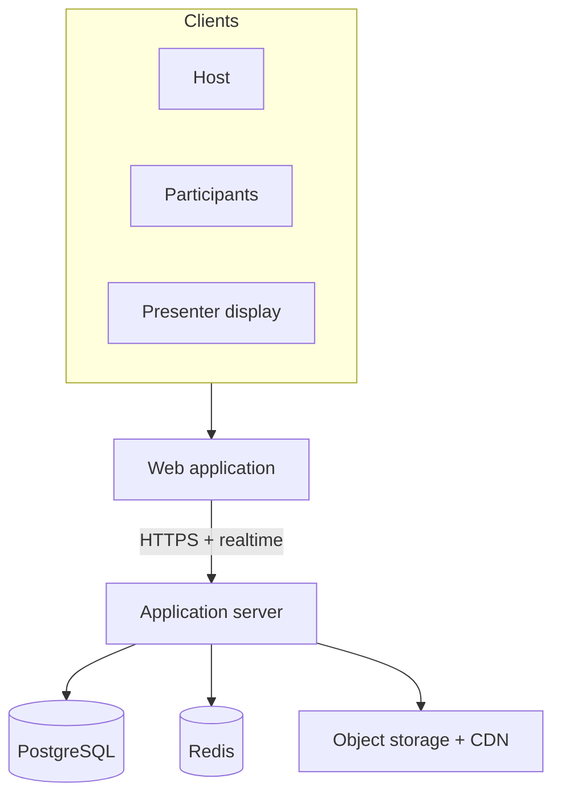

# Architecture

This document describes Quizzy at a **conceptual** level—system roles and major components only. It intentionally omits hostnames, ports, database structures, protocol event names, and internal algorithms.

## Overview

Quizzy is a real-time interactive quiz platform. A browser-based web application talks to an application server over HTTPS and a realtime channel. The server is the source of truth for session state, timing, scoring, and leaderboards. Durable data lives in a relational database; short-lived coordination uses an in-memory data store; media is served from object storage in front of a CDN.

Quizzy is deployed as a web application backed by a real-time application server and managed data/media services.

## System diagram

## Roles

| Role | Responsibility |
| --- | --- |
| **Host** | Creates quizzes, opens rooms, controls when questions start and when the session advances, and monitors the room. |
| **Participant** | Joins with a room code, answers timed questions, and follows personal and room-level results. |
| **Presenter** | Shows a display-oriented view suitable for projectors and stage screens (lobby, question, standings). |

## Components (conceptual)

### Web application

A React + TypeScript single-page app (built with Vite). It renders host, participant, and presenter experiences. Clients compute local countdown displays from server-provided timing windows, but they never decide correctness, points, or session authority.

### Application server

A Node.js service using Fastify for HTTP APIs and Socket.IO for realtime updates. It:

- Authenticates hosts and issues participant session credentials as appropriate
- Owns room and question lifecycle
- Accepts answer submissions, validates them, and scores them
- Broadcasts session progress and leaderboard updates to the room
- Coordinates media upload handshakes so browsers talk to storage via short-lived, server-issued capabilities—not by streaming file bytes through the app server

### PostgreSQL

Stores durable product data: accounts, quizzes, questions, rooms, answers, rankings inputs, themes, and media metadata. Schema and migration details are private.

### Redis

Supports realtime coordination and short-lived operational state (for example presence-related and buffering concerns under load). Key layouts and internals are private.

### Object storage + CDN

Holds images, GIFs, and video for media-rich questions and themes. Public delivery goes through a CDN; the application server authorizes uploads and records metadata only.

## Data flow (happy path)

1. Host creates or selects a quiz and opens a live room.
2. Participants connect through the web app and join the room.
3. Host starts the session; the server publishes the active question and timing window to connected clients.
4. Participants submit answers; the server validates each submission against the live question and deadline, then updates scores.
5. The server distributes updated standings and phase changes (next question, results, finish).
6. Media assets are fetched by clients from object storage / CDN using public or authorized URLs issued in the normal product flow—not by reverse-engineering infrastructure.

## Design principles

- **Server authority** — Correctness, points, response timing for scoring, and quiz state are decided only on the server.
- **Realtime without timer spam** — Clients derive countdowns from server timestamps; the server does not rely on per-second tick broadcasts.
- **Room-scoped broadcast** — Updates go to participants in a room, not via ad-hoc fan-out of private socket lists in documentation terms.
- **Media off the hot path** — Binary media does not pass through the application server on download.

## Technology stack

| Area | Choice |
| --- | --- |
| Frontend | React, TypeScript, Vite |
| Backend | Node.js, Fastify, Socket.IO |
| Database | PostgreSQL, Prisma |
| Coordination | Redis |
| Media | S3-compatible object storage + CDN |

## Out of scope for this document

This public architecture note does **not** document:

- Environment variables or secrets
- Database tables, indexes, or migrations
- Realtime event names or payload shapes
- Scoring formulas or ranking algorithms
- Internal routes, Redis key designs, or buffer implementations
- Provider-specific hostnames or infrastructure endpoints

Those details remain in the private product repository.
